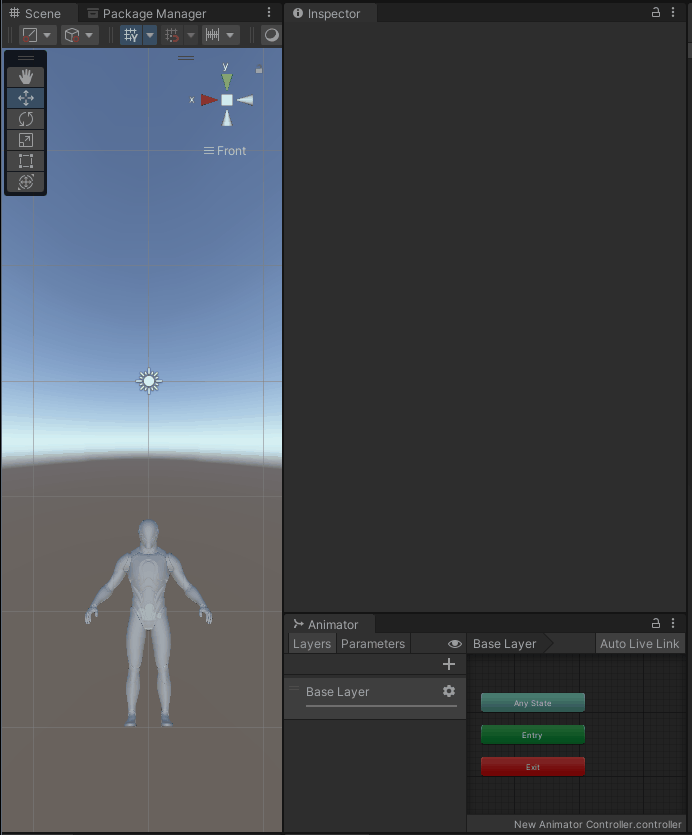

# Unity-Bug-Report-Animation-IN-41675

## About this issue

After adding the `Rigidbody` component, the character's position is rising automatically.

This issue does not occur when running the game frame-by-frame in the Editor.

## How to reproduce

1. Open the "SampleScene".
2. Enter play mode.
3. Observe the character.

Expected result: The character falls down.

Actual result: The character rises up.
