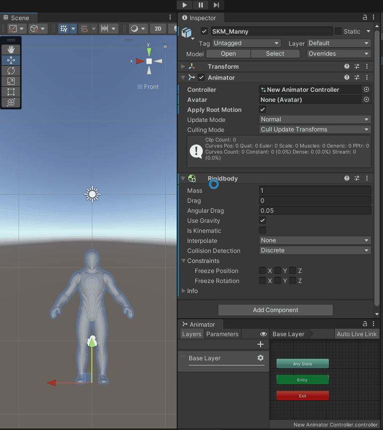

# Unity-Bug-Report-Animation-IN-41675

**Unity has stated that they will not fix this bug.**

> RESOLUTION NOTE:
Thank you for bringing this issue to our attention. Unfortunately, after careful consideration we will not be addressing your issue at this time, as we are currently committed to resolving other higher-priority issues, as well as delivering the new animation system. Our priority levels are determined by factors such as the severity and frequency of an issue and the number of users affected by it. However we know each case is different, so please continue to log any issues you find, as well as provide any general feedback on our roadmap page to help us prioritize.

## About this issue

After adding the `Rigidbody` component, the character's position is rising automatically.

This issue does not occur when running the game frame-by-frame in the Editor.

## How to reproduce

1. Open the "SampleScene".
2. Enter play mode.
3. Observe the character.

Expected result: The character falls down.

Actual result: The character rises up.
